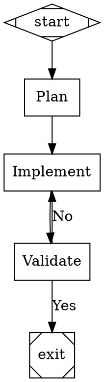
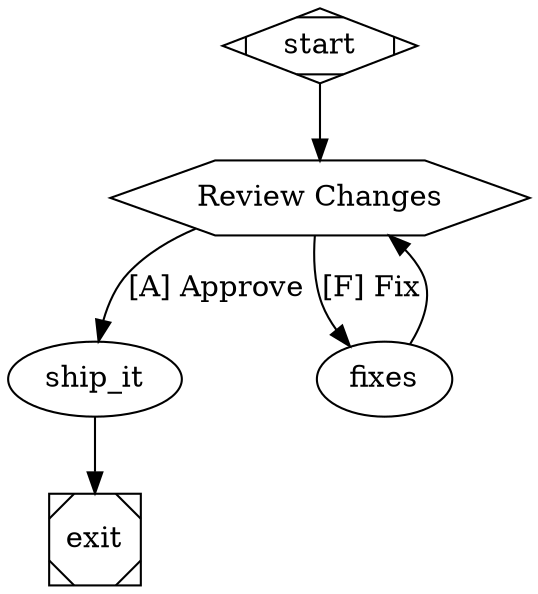

# attractor

A DOT-based pipeline engine that orchestrates multi-stage AI workflows. Define workflows as directed graphs using Graphviz DOT syntax — nodes are tasks, edges are transitions, attributes configure behavior. The engine traverses the graph, executing handlers, saving checkpoints, and routing based on conditions and outcomes.

Built on top of `coding-agent` and `unified-llm` for LLM integration, but the orchestration layer is backend-agnostic.

## Setup

```bash
bun install
```

## Quick Start

```typescript
import {
  parse,
  PipelineRunner,
  createHandlerRegistry,
  StartHandler,
  ExitHandler,
  CodergenHandler,
  ConditionalHandler,
  StubBackend,
  PipelineEventEmitter,
  AutoApproveInterviewer,
} from "attractor";

// 1. Define a pipeline in DOT syntax
const dot = `
digraph MyPipeline {
    graph [goal="Run tests and report results"]

    start     [shape=Mdiamond]
    run_tests [label="Run Tests", prompt="Run the test suite and report results"]
    report    [label="Report", prompt="Summarize the test results"]
    exit      [shape=Msquare]

    start -> run_tests -> report -> exit
}
`;

// 2. Parse the DOT into a Graph
const graph = parse(dot);

// 3. Set up handlers and backend
const registry = createHandlerRegistry();
registry.register("start", new StartHandler());
registry.register("exit", new ExitHandler());
registry.register("codergen", new CodergenHandler());
registry.register("conditional", new ConditionalHandler());

const runner = new PipelineRunner({
  handlerRegistry: registry,
  backend: new StubBackend({ defaultResponse: "All tests passed." }),
  interviewer: new AutoApproveInterviewer(),
  eventEmitter: new PipelineEventEmitter(),
});

// 4. Run the pipeline
const result = await runner.run(graph);
console.log(result.outcome.status);       // "success"
console.log(result.completedNodes);        // ["start", "run_tests", "report", "exit"]
```

## DOT Pipeline Syntax

Pipelines are standard Graphviz `digraph` declarations with typed attributes. One digraph per file, directed edges only.

### Node shapes determine handler type

| Shape | Handler | Purpose |
|---|---|---|
| `Mdiamond` | `start` | Entry point (required, exactly one) |
| `Msquare` | `exit` | Exit point (required, exactly one) |
| `box` | `codergen` | LLM task (default shape) |
| `hexagon` | `wait.human` | Human approval gate |
| `diamond` | `conditional` | Condition-based routing |
| `component` | `parallel` | Parallel fan-out |
| `tripleoctagon` | `parallel.fan_in` | Parallel fan-in / merge |
| `parallelogram` | `tool` | Shell command execution |
| `house` | `stack.manager_loop` | Supervisor loop over child pipeline |

### Branching with conditions



### Human-in-the-loop gate



## Pipeline Engine

`PipelineRunner` is the core execution engine. It traverses the graph from start to exit, executing node handlers, saving checkpoints after each step, and selecting the next edge based on outcomes and conditions.

### Execution lifecycle

```
PARSE -> VALIDATE -> INITIALIZE -> EXECUTE -> FINALIZE
```

1. **Parse** — DOT source to in-memory Graph
2. **Validate** — Lint rules reject invalid graphs
3. **Initialize** — Create context, apply transforms, mirror graph attributes
4. **Execute** — Traverse nodes: handler -> checkpoint -> edge selection -> next node
5. **Finalize** — Emit completion events, return result

### Configuration

```typescript
const runner = new PipelineRunner({
  handlerRegistry,              // maps handler types to Handler instances
  backend: myBackend,           // CodergenBackend for LLM calls
  interviewer: myInterviewer,   // human-in-the-loop interface
  transforms: [                 // graph transforms applied before execution
    new VariableExpansionTransform(),
    new StylesheetTransform(),
  ],
  extraLintRules: [],           // additional validation rules
  eventEmitter: emitter,        // receives pipeline lifecycle events
  logsRoot: "./logs",           // directory for checkpoints and logs
});
```

### PipelineResult

```typescript
const result = await runner.run(graph);

result.outcome.status;       // "success" | "partial_success" | "retry" | "fail" | "skipped"
result.completedNodes;       // ["start", "plan", "implement", "validate", "exit"]
result.context.snapshot();   // Map of all context key-value pairs
```

## Backends

Backends implement `CodergenBackend` — the interface the `codergen` handler calls to get LLM responses. The pipeline definition (DOT file) is backend-agnostic.

| Backend | Description |
|---|---|
| `StubBackend` | Mock responses for testing |
| `SessionBackend` | Wraps a `coding-agent` Session |
| `CliAgentBackend` | Spawns any CLI agent as a subprocess |
| `ClaudeCodeBackend` | Claude Code CLI integration |
| `CodexBackend` | OpenAI Codex CLI integration |
| `GeminiBackend` | Google Gemini CLI integration |

```typescript
// Stub for testing
const stub = new StubBackend({ defaultResponse: "done" });

// Per-node responses
const stub = new StubBackend({
  responses: new Map([
    ["plan", "Here is the plan..."],
    ["implement", "Implementation complete."],
  ]),
});

// Dynamic responses
const stub = new StubBackend({
  responseFn: (node, prompt, context) => {
    return `Processed: ${prompt}`;
  },
});
```

## Interviewers

Interviewers implement the human-in-the-loop pattern. When the pipeline hits a `wait.human` node, it pauses and presents a question to the interviewer.

| Interviewer | Use case |
|---|---|
| `AutoApproveInterviewer` | Auto-approve everything (CI, testing) |
| `ConsoleInterviewer` | Terminal-based interactive prompts |
| `CallbackInterviewer` | Programmable via callback function |
| `QueueInterviewer` | Async queue for pre-loaded answers |
| `RecordingInterviewer` | Record and replay interview sessions |
| `WebInterviewer` | HTTP/WebSocket for web frontends |

```typescript
// Console with timeout
import { ConsoleInterviewer } from "attractor";

const interviewer = new ConsoleInterviewer({
  timeout: 300_000,        // 5 min timeout
  defaultAnswer: "approve",
});
```

## Transforms

Transforms modify the graph before execution. They implement `Transform.apply(graph): Graph`.

| Transform | Purpose |
|---|---|
| `VariableExpansionTransform` | Expand `$goal` and other variables in attributes |
| `StylesheetTransform` | Apply CSS-like model stylesheet rules to nodes |
| `GraphMergeTransform` | Inline sub-graphs for composition |

```typescript
const runner = new PipelineRunner({
  handlerRegistry: registry,
  transforms: [
    new VariableExpansionTransform(),
    new StylesheetTransform(),
  ],
});
```

## Events

Subscribe to pipeline lifecycle events via `PipelineEventEmitter`:

```typescript
import { PipelineEventEmitter, PipelineEventKind } from "attractor";

const emitter = new PipelineEventEmitter();

// Consume events
for await (const event of emitter.events()) {
  switch (event.kind) {
    case PipelineEventKind.PIPELINE_STARTED:
      console.log("Pipeline started");
      break;
    case PipelineEventKind.STAGE_STARTED:
      console.log(`Stage: ${event.data["nodeId"]}`);
      break;
    case PipelineEventKind.STAGE_COMPLETED:
      console.log(`Done: ${event.data["nodeId"]} -> ${event.data["status"]}`);
      break;
    case PipelineEventKind.PIPELINE_COMPLETED:
      console.log("Pipeline finished");
      break;
  }
}
```

Event kinds: `PIPELINE_STARTED`, `PIPELINE_COMPLETED`, `PIPELINE_FAILED`, `STAGE_STARTED`, `STAGE_COMPLETED`, `STAGE_FAILED`, `STAGE_RETRYING`, `PARALLEL_STARTED`, `PARALLEL_BRANCH_STARTED`, `PARALLEL_BRANCH_COMPLETED`, `PARALLEL_COMPLETED`, `INTERVIEW_STARTED`, `INTERVIEW_COMPLETED`, `INTERVIEW_TIMEOUT`, `CHECKPOINT_SAVED`, `PIPELINE_RESTARTED`, `TOOL_HOOK_PRE`, `TOOL_HOOK_POST`.

## HTTP Server

Run pipelines remotely via a REST API with SSE event streaming:

```bash
bun run bin/attractor-server.ts
# Attractor server listening on http://127.0.0.1:3000
```

```bash
# Submit a pipeline
curl -X POST http://localhost:3000/pipelines \
  -H "Content-Type: application/json" \
  -d '{"dot": "digraph G { start [shape=Mdiamond]; exit [shape=Msquare]; start -> exit }"}'
# {"id": "abc-123", "status": "running"}

# Check status
curl http://localhost:3000/pipelines/abc-123
# {"id": "abc-123", "status": "completed", "result": {...}}

# Stream events (SSE)
curl http://localhost:3000/pipelines/abc-123/events

# Answer human-in-the-loop questions
curl http://localhost:3000/pipelines/abc-123/questions
curl -X POST http://localhost:3000/pipelines/abc-123/questions \
  -H "Content-Type: application/json" \
  -d '{"value": "approve"}'

# Cancel
curl -X POST http://localhost:3000/pipelines/abc-123/cancel
```

### Server endpoints

| Method | Path | Description |
|---|---|---|
| `POST` | `/pipelines` | Submit a pipeline (body: `{"dot": "..."}`) |
| `GET` | `/pipelines/:id` | Get pipeline status and result |
| `GET` | `/pipelines/:id/events` | SSE event stream |
| `GET` | `/pipelines/:id/questions` | Get pending human question |
| `POST` | `/pipelines/:id/questions` | Answer pending question |
| `GET` | `/pipelines/:id/context` | Get pipeline context |
| `GET` | `/pipelines/:id/checkpoint` | Get pipeline checkpoint |
| `POST` | `/pipelines/:id/cancel` | Cancel running pipeline |

## Validation

Validate DOT pipelines before execution:

```typescript
import { validate, validateOrRaise } from "attractor";

const graph = parse(dotSource);
const diagnostics = validate(graph);

// Or throw on errors
validateOrRaise(graph);
```

## Context

`Context` is a key-value store that flows through the pipeline. Handlers read from it and return `contextUpdates` in their `Outcome`.

```typescript
context.set("key", "value");
context.get("key");            // "value"
context.get("missing", "default");
context.has("key");            // true
context.snapshot();            // Record<string, string>
context.appendLog("did thing");
```

The engine automatically sets:
- `graph.goal` — from the graph's `goal` attribute
- `graph.label` — from the graph's `label` attribute
- `outcome` — status of the last completed node
- `current_node` — ID of the currently executing node

## Architecture

```
PipelineRunner          Graph traversal, retry, checkpoints, events
  +-- HandlerRegistry   Maps node types to Handler implementations
  +-- CodergenBackend   LLM invocation (pluggable)
  +-- Interviewer       Human-in-the-loop (pluggable)
  +-- Transforms        Graph pre-processing (variable expansion, stylesheet, merge)
  +-- EventEmitter      Lifecycle event streaming
  +-- Context           Key-value state flowing through the pipeline
```

## Testing

```bash
bun test
```
