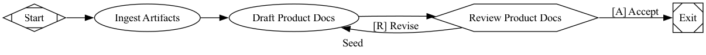
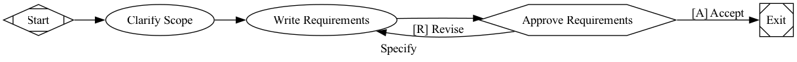
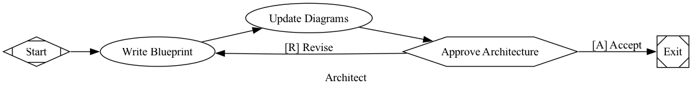
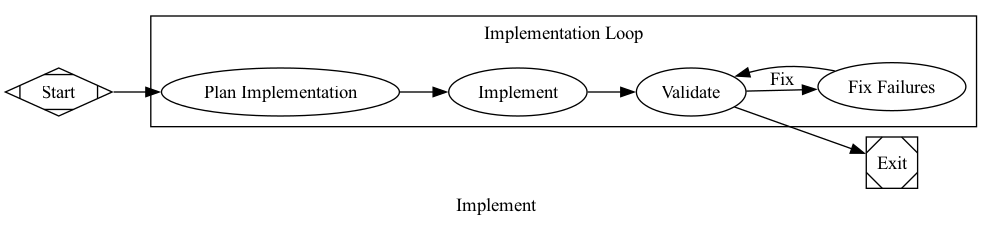
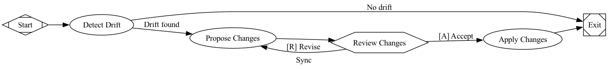
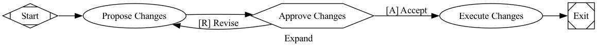

# Software Factory Pipelines

Six Attractor pipelines that implement a spec-driven software factory. Markdown docs are the source of truth — code is a derived artifact.

## Document Structure

The factory operates on three layers:

1. **Product** — what to build (requirements, acceptance criteria)
2. **Architecture** — how to build it (blueprints, diagrams, stack decisions)
3. **Code** — the implementation (derived from the first two)

The first two layers are markdown docs. The third is generated from them.

```
docs-internal/
  product/                              Layer 1: WHAT to build
    business-problem.md
    personas.md
    product-description.md
    current-state.md
    success-metrics.md
    technical-requirements.md
    features/
      NNN-feature.md                    per-feature requirements + acceptance criteria

  architecture/                         Layer 2: HOW to build it
    foundation-blueprints/
      backend.md                        stack-wide backend decisions
      data-layer.md                     stack-wide data decisions
      frontend.md                       stack-wide frontend decisions
    system-diagrams/
      entity-relationship-diagram.md
      sequence-diagram.md
      system-architecture.md
    features/
      NNN-feature.md                    per-feature blueprint (data model, API, UI)

src/                                    Layer 3: the implementation (generated)
```

## Pipelines

### 1. Seed

Bootstrap product context from raw inputs. Run once per product.

**Input:** Conversations, notes, designs, existing code — anything unstructured.
**Output:** Filled `product/` docs.



[seed.dot](seed.dot) | Prompts: [ingest](prompts/seed/ingest.md), [draft](prompts/seed/draft.md)

---

### 2. Specify

Define what a feature does in implementation-agnostic terms. Run once per feature.

**Input:** Product context docs + a feature idea (passed as `goal`).
**Output:** `product/features/NNN-feature.md` with user stories and acceptance criteria.



[specify.dot](specify.dot) | Prompts: [clarify](prompts/specify/clarify.md), [require](prompts/specify/require.md)

---

### 3. Architect

Translate approved requirements into a technical blueprint. Run once per feature, after Specify.

**Input:** `product/features/NNN-feature.md` + foundation blueprints + codebase.
**Output:** `architecture/features/NNN-feature.md` + updated system diagrams.



[architect.dot](architect.dot) | Prompts: [blueprint](prompts/architect/blueprint.md), [diagram](prompts/architect/diagram.md)

---

### 4. Implement

Generate working code from a feature blueprint. Run once per feature, after Architect. No human gate — the blueprint is the approved plan, and the validate/fix loop converges autonomously.

**Input:** Feature blueprint + foundation blueprints + codebase.
**Output:** Committed code (migrations, models, API, UI, tests).



[implement.dot](implement.dot) | Prompts: [plan](prompts/implement/plan.md), [implement](prompts/implement/implement.md), [validate](prompts/implement/validate.md), [fix](prompts/implement/fix.md)

All nodes share `fidelity="full"` with `thread_id="impl"` so the agent maintains full context across the loop. `goal_gate=true` on Validate ensures the pipeline cannot exit until all acceptance criteria pass.

---

### 5. Sync

Detect and resolve drift between the three layers. Run continuously (after merges, on schedule, or on demand).

**Input:** A change to any layer (code, product docs, or architecture docs).
**Output:** Updated docs or code that restore alignment.



[sync.dot](sync.dot) | Prompts: [detect](prompts/sync/detect.md), [propose](prompts/sync/propose.md), [apply](prompts/sync/apply.md)

Short-circuits to Exit when no drift is detected, avoiding unnecessary human interaction.

---

### 6. Expand

Evolve the product by adding, modifying, or removing features. Run as needed.

**Input:** Human intent (passed as `goal`), e.g. "split feature X" or "add Y".
**Output:** Updated document tree, ready for Implement.



[expand.dot](expand.dot) | Prompts: [propose](prompts/expand/propose.md), [execute](prompts/expand/execute.md)

---

## How They Compose

```
Seed ──→ Specify ──→ Architect ──→ Implement
 (1x)    (1x per      (1x per       (1x per
          feature)     feature)      feature)
              ↕            ↕            ↕
            Sync ←────── Sync ←────── Sync
          (continuous)
              ↕
           Expand
        (as needed)
```

- **Seed** runs once to bootstrap product context
- **Specify** and **Architect** run once per feature to produce requirements and blueprints
- **Implement** runs once per feature to produce code
- **Sync** runs continuously to keep all three layers aligned
- **Expand** runs when the product evolves (new features, splits, removals)

The docs are always the source of truth. If you delete all code and run Implement for every feature, you get the system back.

## Prompt References

DOT files reference prompts with `@`-style paths relative to the DOT file:

```dot
plan [label="Plan Implementation", prompt="@prompts/implement/plan.md"]
```

The `@` prefix tells the engine to read the file contents as the prompt. Prompts support `$goal` variable expansion.
